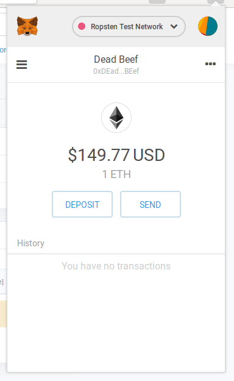

# Ethereum Vanity Wallet Generator

This tool generates Ethereum public and private keypair until it finds address
which contains required prefix and/or suffix.
Address part can contain only digits and letters from A to F.

## Installation

```
go install github.com/meehow/ethereum-vanity-wallet@latest
```

## Usage

➜  ~ ethereum-vanity-wallet -p ab -s cd

Address: 0x**Ab**719Dc27043be01e9ef02026407163455Ae7f**Cd** PrivateKey: 0a2ab8789247f97b1a54919c3ff45dda4ec26ecc4f9a1b3df82f9c7090dafe83

Address: 0x**ab**56b21826316f56f1Ee7e2e69C489A51EB8A5**cd** PrivateKey: f9fd0529afeeb74e3918447cf69f4fadc3684306e613f92f38380548134e2760

Address: 0x**ab**f6AC87BBad30215359739A6EE4159F4c4a23**cd** PrivateKey: c5bc2fac7fb08cc883adf37c0e0edeb142978859668546ac859bf7b1e8fe8767

^C

[](https://asciinema.org/a/228369)

## Benchmarks

My laptop with i7-6500U CPU can generate around 6500 keys per second per core.

```
pkg: github.com/meehow/ethereum-vanity-wallet
BenchmarkNewKeyForDirectICAP-4            	      30	  35699828 ns/op
BenchmarkNewKeyForDirectICAPNotRandom-4   	   10000	    157199 ns/op
BenchmarkRawEcdsa-4                       	   10000	    152757 ns/op
BenchmarkRawEcdsaNotRandom-4              	   10000	    152196 ns/op
```

## What is the purpose of this tool?

Having ETH address, with few letters which are defined by us, makes it easier
to visually identify this account among others. In opposite to
[Ethereum Name Service](https://ens.domains/), it doesn't require special
support by wallet implementation and it's for free.


